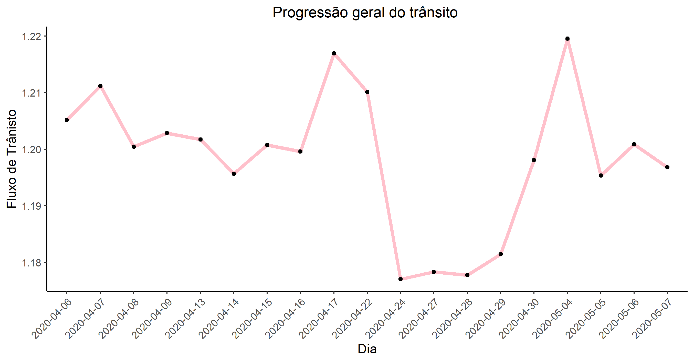
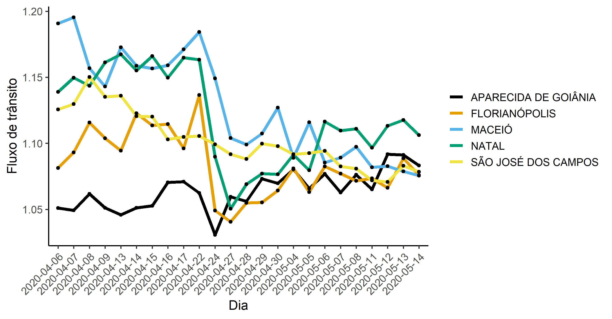
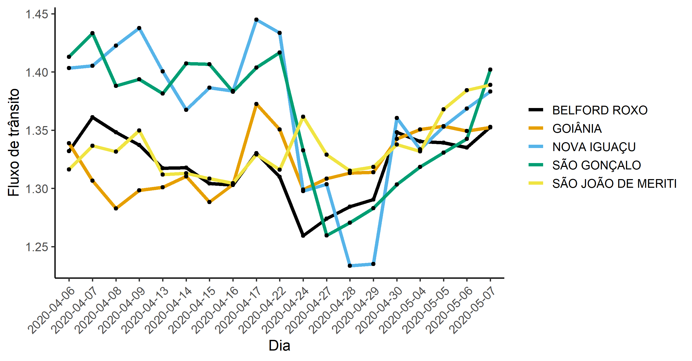
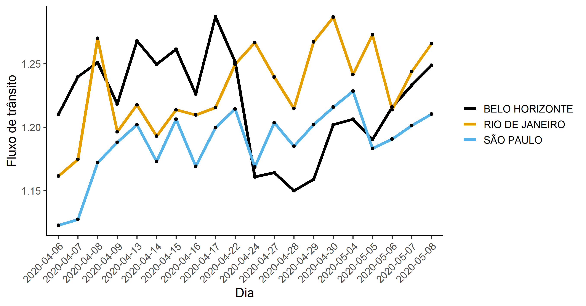
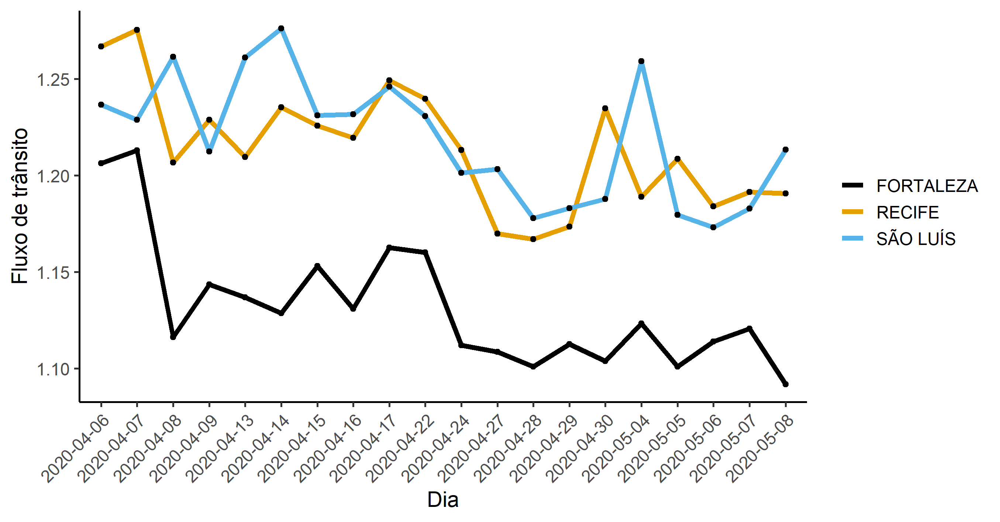
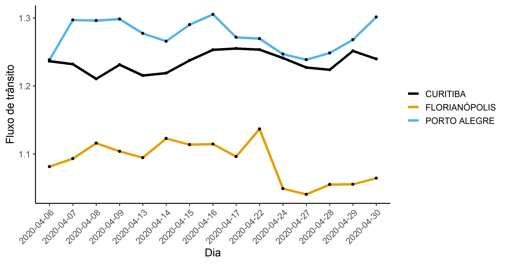
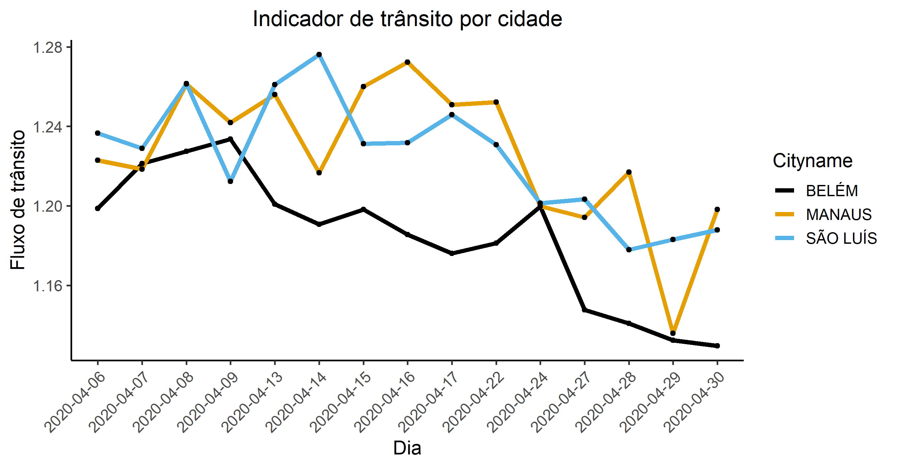

---
---

<link rel="stylesheet" href="styles.css" type="text/css">

# Monitor de Quarentena Usando Dados de Trânsito do Google

&nbsp;

Esse site mostra um indicador de quarentena usando os dados do [API do Google Maps](https://developers.google.com/maps/documentation/directions/intro). O raciocício básico da medida é que se as cidades estão em quarentena, as ruas estarão desertas e não haverá trânsito nenhum na cidade.

&nbsp;

*Metodologia.* A medida do indicador é muito simples. O tempo para cruzar a cidade de madrugada de um extremo a outro, passando pelo centro, é usado como o indicador de referência mínimo. O indicador é simplismente a razão tempo necessário para atravesar a cidade durante o dia/tempo para atravessar a cidade de madrugada. Quanto maior esse tempo, mais trânsito a cidade tem e menor é sua quarentena. Cada cidade é avaliada em dois trajetos: o trajeto norte/sul (ir do extremo norte ao extremo sul) e o leste/oeste; sempre passando pelo centro da cidade. 

&nbsp;

*Amostra.* A amostra cobre [as 50 cidades mais populosas do Brasil](https://pt.wikipedia.org/wiki/Lista_de_munic%C3%ADpios_do_Brasil_acima_de_cem_mil_habitantes). As informações são colhidas 10 vezes por dia todos os dias. Porém, para deixar o indicador mais limpo, iremos mostrar abaixo sobre os dias de trabalho (excluindo feriados e fim da semana) e somente os horários das 8hs, 9hs, 12hs, 17hs, 18hs, e 19hs. A coleta de dados começou em 06 de abril de 2020.

Abaixo está o indicador atualizado de cada um das cidades individualizado.

&nbsp;

&nbsp;

## Indicador geral de quarentena. 

&nbsp;

Abaixo está o indicador do fluxo de trânsito das 50 cidades da amostra.

&nbsp;

&nbsp;

*Comentário:* quanto mais próximo de 1 (o valor mínimo teórico, o tempo de atravessar a cidade de madrugada), *maior* é a adesão á quarentena. Quanto maior o valor do indicador, menor é a adesão à quarentena. Podemos observar que as maiores cidades brasileiras começaram lentamente a quarentena a partir do dia 06. Depois de um pequeno repique depois do dia 17/04, houve uma forte guinada em direção ao uma quarentena mais dura. O aumento pontual do dia 30 de abril ainda não configura uma tendência. Aparentenmente, os as vésperas de feriado (como dia 17 e dia 30) levam a um repique do indicador.

&nbsp;

&nbsp;

## As cidades que MAIS respeitam a quarentena são:

&nbsp;

&nbsp;

&nbsp;

## As cidades que MENOS respeitam a quarentena são:

&nbsp;

&nbsp;

&nbsp;

## comparação entre cidades da mesma região

&nbsp;

Abaixo temos a comparação entre as principais capitais do Sudeste, Nordeste, Sul e Norte, respectivamente.

&nbsp;

&nbsp;

&nbsp;

&nbsp;

